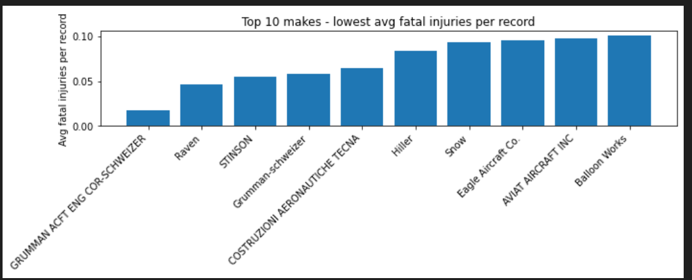
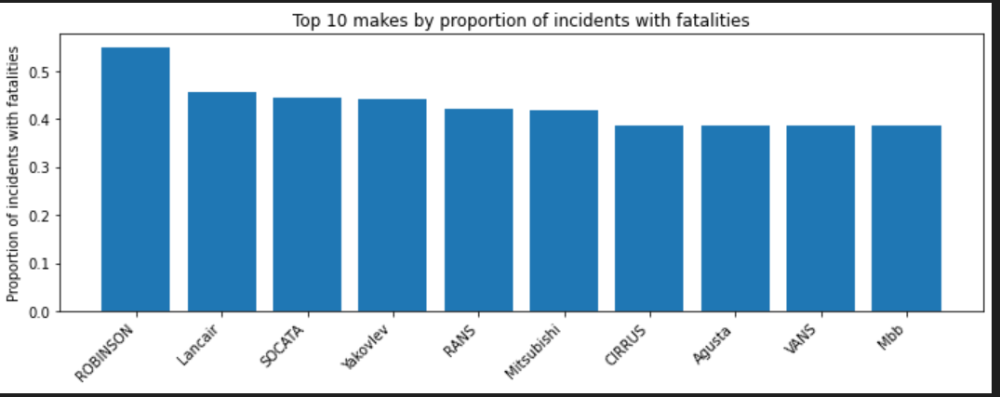
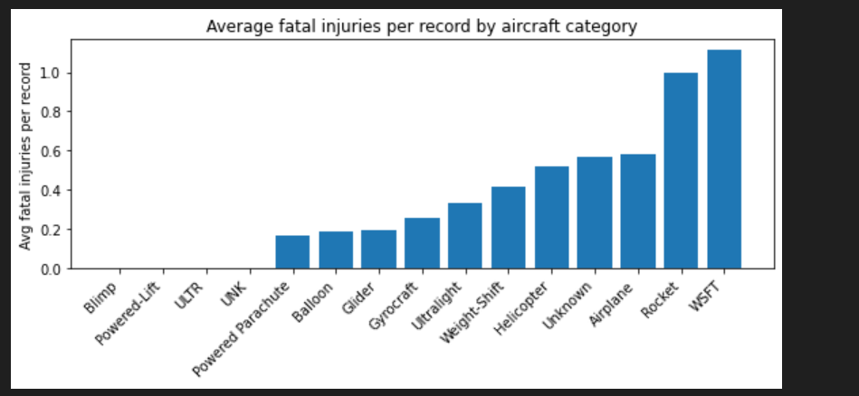

# New-Aviation-Fleet-Acquisition-Risk-Analysis

## Introduction

This analysis uses the aviation dataset to allow us to quantify the overall risk associated with different types of aircraft and identify which configurations have historically demonstrated safer performance to determine the Fleet acquisition as a new business venture.Specifically, using aircraft category, engine type, number of engines, and manufacturer (make) relate to historical accident outcomes, including injury severity, aircraft damage, and counts of fatal, serious, minor, and uninjured passengers. By interpreting injury and damage patterns across manufacturers and engine setups, we can provide clear guidance on which fleet pose lower operational risk and are therefore better suited for our company’s entry into commercial and private aviation services.

## Overview

This is how this study has been achieved:

- Analyzed 60 years of aircraft accident records

- Evaluated risk based on:
    - Aircraft category
    - Engine type & number of engines
    - Make (manufacturer)
    - Injury severity
    - Aircraft damage outcomes
- Finally, generate three insights each tied to business recommendation.

## Business Understanding

Our company wants to invest in aircraft for commercial and private operations.Before purchasing aircraft, leaders need to understand:

- Which aircraft types historically have the lowest accident and fatality rates

- Whether engine type or number of engines affects safety

- Which manufacturers have historically safer aircraft

- What types of accidents typically lead to severe injuries or total aircraft loss

BUSINESS QUESTION

Which aircrafts generally in regards to type and specifications pose a low risk of operation for our proposed new aviation business?

### Data Understanding
*Source of Data* :Dataset by National Transportation Safety Board Aviation Accident Data(1962-2023).

## *Description of Data*
The data typically contains records of incidents, aircraft operation, make, airports operated in, flight details and safety outcomes.(fatal, serious, injured, uninjured). The contributing factors to injuries for different types of aircrafts.

## *Three Visualizations*

*Plot A* : Top 10 lowest avg_fatal_per_record(In respect to Make)

*Plot B* : Worst 10 by proportion incidents with fatalities(In respect to Make)

*Plot C* : By aircraft category

## Conclusion
In conclusion based on our choice of data from the specific columns used above, we derive the top 10 makes with lowest average fatal incidents per record, top 10 makes by proportional of incidents with fatalties and average fatal injuries fatal injuries per record by aircraft category.This will enable the organization determine the most suitable make of aircraft to consider and the type of aircraft to purchase while entering the aviation industry that ensures a minimum risk of operation while safeguiding the lives of future clients altogether ensuring continuity and maximum profits in the new venture. These characteristics are consistently associated with lower fatal and serious injury counts, higher uninjured totals, and less severe aircraft damage—making them the most prudent choice for a company entering the aviation industry.

